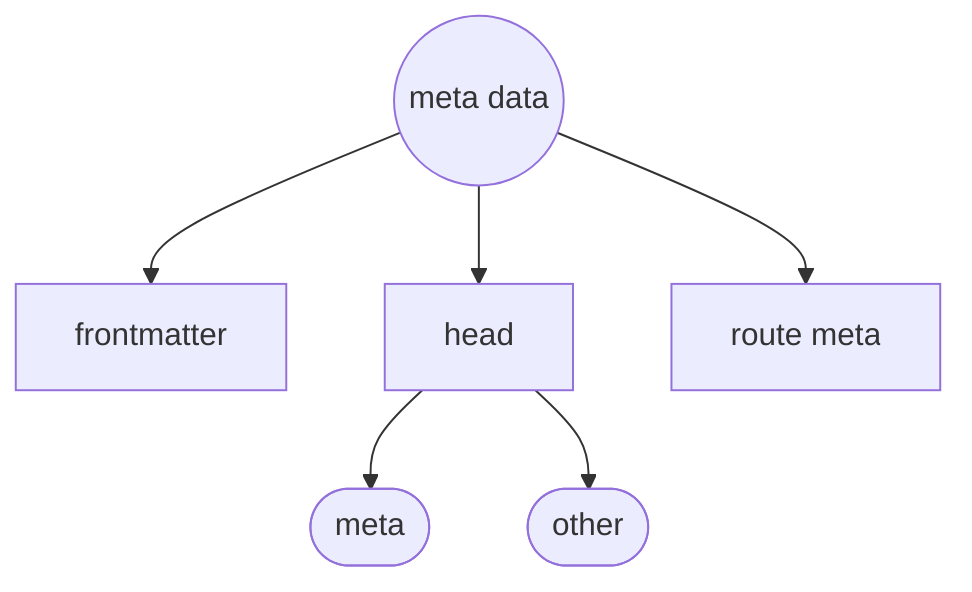

# vite-plugin-md

Markdown for Vite

- Use Markdown as Vue components
- Use Vue components in Markdown

[](https://www.npmjs.com/package/vite-plugin-md)

> ℹ️ **0.2.x is for Vite 2 and 0.1.x is for Vite 1**

## Getting Started

### Install

```bash
npm i vite-plugin-md -D # yarn add vite-plugin-md -D
```

Add it to `vite.config.js`

```ts
// vite.config.js
import Vue from '@vitejs/plugin-vue'
import Markdown from 'vite-plugin-md'

export default {
  plugins: [
    Vue({
      include: [/\.vue$/, /\.md$/], // <--
    }),
    Markdown()
  ],
}
```

### Usage

1. Import **Markdown** as a **Vue** component

   ```html
   <template>
     <HelloWorld />
   </template>

   <script>
   import HelloWorld from './README.md'

   export default {
     components: {
       HelloWorld,
     },
   }
   </script>
   ```

2. Use **Vue** Components inside **Markdown**

   You can even use Vue components inside your markdown, for example

   ```html
   <Counter :init='5'/>
   ```

   <Counter :init='5'/>

   Note you can either register the components globally, or use the `<script setup>` tag to register them locally.

   ```ts
   import { createApp } from 'vue'
   import App from './App.vue'
   import Counter from './Counter.vue'

   const app = createApp(App)

   // register global
   app.component('Counter', Counter) // <--

   app.mount()
   ```

   ```html
   <script setup>
   import { Counter } from './Counter.vue
   </script>

   <Counter :init='5'/>
   ```

   Or you can use [`vite-plugin-components`](./docs/Integrations.md#work-with-vite-plugin-components) for auto components registration.

## Configuration

Configuration of this plugin fits neatly into two categories:

1. **Configuration** of Core Features
  
     Like other Vite plugins you probably use this plugin offers a dictionary of configuration options which allow you to adjust certain built-in behaviors. These are all strongly typed and should be relatively self-documenting. For example:


    > See [the tsdoc](./src/types.ts) for more info of config options

3. **Extending** Core Functionality

    There are two main means for _extending_ the functionality of this plugin:

    - [`markdown-it`](https://github.com/markdown-it/markdown-it) plugins

      Under the hood this plugin leverages [`markdown-it`](https://github.com/markdown-it/markdown-it) for converting Markdown content to HTML. This parser is very mature and has a rich set of plugins that you use quite easily. If you don't find what you want you can also build your own plugin relatively easily [ [docs](https://markdown-it.github.io/markdown-it/) ].

      Whether you're _using_ or _building_ a plugin, you will incorporate it into this plugin using the `markdownItSetup` property. Alternatively you can also set configuration options of **markdown-it** with `markdownItOptions`:

      ```ts
      // vite.config.js
      import Markdown from 'vite-plugin-md'

      export default {
        plugins: [
          Markdown({
            markdownItOptions: {
              html: true,
              linkify: true,
              typographer: true,
            },
            markdownItSetup(md) {
              // add anchor links to your H[x] tags
              md.use(require('markdown-it-anchor'))
              // add code syntax highlighting with Prism
              md.use(require('markdown-it-prism'))
            }
          ),
        ]
      },
      ```

    - [`Builder APIs`](./docs/LinkBuilder.md)

      Builder API's are mini-configurators for a particular feature area. The idea behind them is to allow extending functionality quickly with _sensible defaults_ but also providing their own configurations to allow users to grow into and configure that feature area. The builder APIs available are:

        - [Link Builder](./docs/LinkBuilder.md)
        - [Meta Builder](./docs/MetaBuilder.md)

      If you wanted to use both of these builders in their default configuration, you would simply add the following to your options config for this plugin:

      ```ts
      import Markdown, { link, meta } from 'markdown-it-md'
      export default {
        plugins: [
          Markdown({
            builders: [ link(), meta() ]
          })
        ]
      }
      ```

      If you're interested in building your own you can refer to the [Builder API](./docs/BuilderApi.md) docs.

The configuration for this plugin is a fully typed dictionary of options and therefore is largely self-documenting but here we will highlight a few concepts and structures up front:

## Metadata Management

This plugin provides strong support for metadata in your markdown content. In general we think of metadata as fitting into the following structure:



Now while that seem like a lot of _meta_ for _metadata_ for most most people you can just isolate to the most common of metadata in Markdown content: **frontmatter**.

### Frontmatter

Frontmatter is a first class citizen in this plugin and will be parsed and injected into Vue's instance data `frontmatter` field (note: you can turn off via options if you want to suppress this).

For example:

```md
---
name: My Cool App
---

# Hello World

This is {{name}}
```

Will be rendered as

```html
<h1>Hello World</h1>
<p>This is My Cool App</p>
```

> Note: if you inspect the data in VueJS devtools you may notice that Markdown pages has not only the variable `{{ name }}` to use but also `{{ frontmatter.name }}` and the values are the same. This may seem like senseless duplication but in fact relates to some important edge cases relating to using a _wrapper_ component, props passing, and the ability to import frontmatter properties external to the page at hand. TLDR ... sometimes "less is more" but in this case "more is more".

## Page HEAD Properties

The two most common needs for injecting into the HEAD of a markdown page is:

1. Adding `<meta ...>` tags for social media sites like Facebook and Twitter to get more visually rich and descriptive links when people share links to your page
2. Adding the "title" tag to a page (which also impacts your browser history)

There are of course more but it's useful to group them into HEAD (general like title) and META (which follow strong and distinct attribute patterns).

If you want to manage either with this plugin you'll need to leverage the [`@vueuse/head`](https://github.com/vueuse/head) package. To get this installed:

```bash
npm i @vueuse/head
```

Then tell this plugin that you're using HEAD:

```js
// vite.config.js
import Vue from '@vitejs/plugin-vue'
import Markdown from 'vite-plugin-md'

export default {
  plugins: [
    Vue({
      include: [/\.vue$/, /\.md$/],
    }),
    Markdown({
      headEnabled: true // <--
    })
  ]
}
```

Now you can setup default values frontmatter attributes for `title` and `meta` will be directed to HEAD and META attributes respectively.

```js
// src/main.js
import { createApp } from 'vue'
import { createHead } from '@vueuse/head' // <--

const app = createApp(App)

const head = createHead({ title: "My Cool App" }) // <--
app.use(head) // <--
```


```yaml
---
title: Even Cooler Page
meta:
  - name: description
    content: Hello World
  - name: url
    content: https://cool-site.com
---
```

In the above example, this plugin has done three things:

1. This page -- _being particular cool_ -- will have the title of "Even Cooler Page" and other pages which don't specify will still have the title of "My Cool App" as a default.
2. The meta tags `description` and `url` will be put into the head block and be given a slightly "enhanced" treatment (more in a moment)
3. The `title` -- which we discussed in #1 is _also_ added as a meta tag with the same fancy "enhanced" treatment.

Now before you become concerned that this sounds too _magical_ please understand it is actually very straight forward once you understand the processing steps and the idea of "mapping" that dictates what goes where.

To understand more details on _mapping_, _route metadata_ as well as how to configure like a star ... point your browser to [the Meta Builder](./docs/MetaBuilder.md).

## Options


## Examples

See the [/example](./example).

Or the pre-configured starter template [Vitesse](https://github.com/antfu/vitesse).

## Integrations

This plugin has good integrations with several other plugins, including:

- [`vite-plugin-pages`](https://github.com/hannoeru/vite-plugin-pages)
- [`vite-plugin-components`](https://github.com/antfu/vite-plugin-components)
- and [`vite-plugin-vue-layouts`](https://github.dev/JohnCampionJr/vite-plugin-vue-layouts)

For details, refer to the [Integration Page](./docs/Integrations.md).

## TypeScript Shim

```ts
declare module '*.vue' {
  import { ComponentOptions } from 'vue'
  const Component: ComponentOptions
  export default Component
}

declare module '*.md' {
  import { ComponentOptions } from 'vue'
  const Component: ComponentOptions
  export default Component
}
```

## License

MIT License © 2020-PRESENT [Anthony Fu](https://github.com/antfu)
