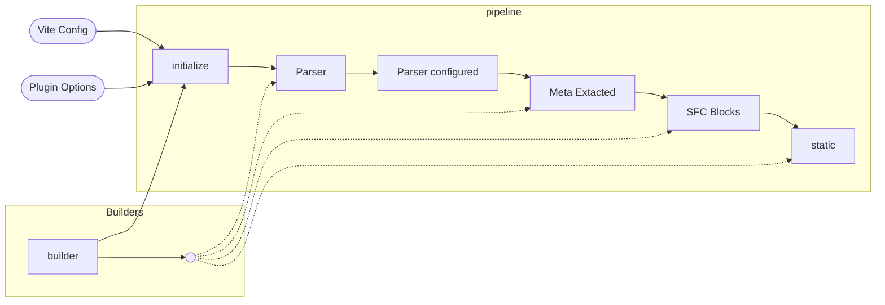

# Build Pipeline
> References: [Builder API](./BuilderApi.md)

The build pipeline represents the steps which must be executed to properly convert the Markdown input to a VueJS component. These are the internal steps which are taken but they also map rather conveniently to event hooks which 

 useful to understand when you're creating a Builder plugin and possibly for debugging nuanced issues too.

This pipelining processes looks something like this:


> Note: always the finest grain and most up-to-date representation will be the _types_ associated with this: see [PipelineStage](../src/%40types/pipeline.ts) and []

## Event Hooks

- **Initialize**. Builder API's will always get a chance to influence the initialize the _plugin options_ as well as contribute their own specific contribution. The order in which Builders update the _options_ (aka, `ResolvedOptions` data structure) is non-deterministic and so it's good practice to take precautions to be _additive_ where possible rather than _destructive_ to existing configuration.
- **Other Hooks**. A builder gets to choose one or more hooks where they want to participate in some fashion.
  - By example:
    - the included [`link`](./LinkBuilder.md) builder hooks into the **Parser** event hook so that it can intercept all links on the page and do it's magic.
    - the included [`meta`](./MetaBuilder.md) builder hooks into the **Meta Extracted** event and then produces a **Meta Mapped** event for other builders to hook into if they're interested.
  - The [`meta`](./MetaBuilder.md) example is interesting because of it's ability to produce a new event and push it back into the pipeline
    - Let's zoom in a little by imagining a configuration that looks like this:

      ```ts
      export default {
          plugins: [
              Markdown({
                  builders: [
                      b1(),
                      meta(),
                      b3(),
                      b => b.add('b4', 'MetaMapped')(ctx => { ...ctx, frontmatter: {
                          ...ctx.frontmatter,
                          newProp: 'some value'
                      }})
                  ]
              })
          ]
      }
      ```

    - With this configuration, the pipeline executes up to the `MetaExtracted` stage and then calls the builders attached to that event:
        ```mermaid
        flowchart LR

            subgraph Core Pipeline
            me[MetaExtracted] --> seq(( ... ))
            sfc(SFC Blocks)
            end

            subgraph Builders for MetaExtracted
            b1
            meta
            b3
            done([Done]) --> sfc
            end
            
            subgraph produced events
            b1 --> bp1([?])
            seq --> b1
            bp1 --> meta
            meta --> mm[MetaMapped]
            b3 --> bp3([?])
            bp3 --> done([Done])
            end
            
            subgraph Builders for MetaMapped
            mm --> b4[b4]
            b4 --> d2([Done])
            d2 --> b3
            end

        ``` 
    

## Event Payload

All event hooks receive a `Pipeline<PipelineStage>` based state variable which will have all available information at the stage you are currently operating at. 

> Note: when a builder _provides_ an event, the payload will be all of the properties of the event stage which they participated at

Of course the most up-to-date documentation is always the code but the goal is to have this pipeline model change very little over time. That said, this process is all managed 