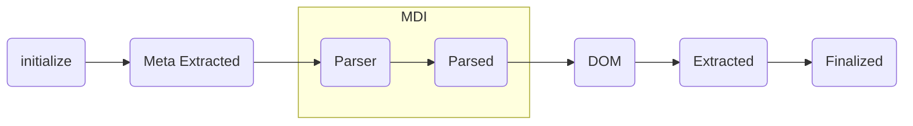

# Builder API

> References: [Build Pipeline](./BuildPipeline.md), [Meta Builder](./MetaBuilder.md), [Link Builder](./LinkBuilder.md)

The Builder API provides a powerful way to extend the functionality of this plugin in any way you see fit. This is done through a traditional hook-based transformation pipeline. Before we go further, let's take a look at the pipeline and the corresponding "hooks" which are exposed to developers:

## The Pipeline



Each stage in this pipeline provides a "before" and "after" hook which you can tap into and because these hooks are asynchronous you can even start to _consider_ callouts to databases, API's, and more to complete your transform (bearing in mind of course that performance must be closely guarded). Outside of these async use-cases, most of your transforms will likely best be kept to being synchronous but you can choose freely as you need. You're in charge of your pipeline ... by default this plugin _only_ does it's core features which is primarily converting MD files to VueJS components.

## The Pipeline Stages

Let's now go through each stage in the pipeline and talk about what is available at this stage:

1. `initialize` - the initialization step is only intended for _builders_ to express and finalize their configuration but not to do any real mutation of the content of a page.
2. `meta extracted` - using the popular Frontmatter parser called [**Graymatter**](https://github.com/jonschlinkert/gray-matter), the MD file is passed through with the intention of extracting the metadata. Builders who attach to this phase of the pipeline will have frontmatter properties made available to them but no further processing has yet taken place.
3. `parser` and `parsed` - both of these stages revolve around the conversion of MD content to HTML content. As is illustrated in the diagram above, these processes are by default handled fully by [**markdown-it**](https://github.com/markdown-it/markdown-it) (aka, MDI) and it's plugins. As a _builder_ however, it can be quite useful to be handed the MDI parser so that you might extend behavior in a similar way to a MDI plugin or alternatively, simply to coordinate the use of one or more MDI plugins while wrapped in builder's isolation. The primary difference between the `parser` and `parsed` pipeline stages is that `parser` hooks you into right before the MDI parser is engaged, and `parsed` gives you the after view.
4. `dom` - up to this point the key pipeline properties which are being passed and mutated through the pipeline are provided in _string_ form and your mutations will likely rely on RegEx or other similar techniques to mutate the page as you see fit. In this stage of the pipeline the string representations are converted to DOM representations. Specifically we provide the DOM API via [`happy-dom`](https://github.com/capricorn86/happy-dom). This can provide a possibly more useful API surface for manipulating the HTML content that exists.
5. `extracted` - up to this point the HTML section combined not only "template" HTML but also the script tags, and/or any other custom blocks you might have in your eventual SFC. No longer ... in this stage, the hooks are provided with discrete variables for each part of the eventual SFC component.
6. `finalize` - at this final stage, everything in the pipeline will be reduced to the final "component" representation (as a _string_). This is the very last chance you get to make changes before the "component" being sent to VueJS's compiler to be converted to a SFC.

> For those of you who've noticed that the core plugin has an option called `transform` with both a "before" and "after" property ... be aware that this is a complimentary -- though less powerful means -- of tapping into the pipeline. These two methods have been maintained (and will be) to provide backwards compatibility but they are strictly synchronous in nature and are called at the very beginning and end of the pipeline discussed above.

## Creating a Builder

So now that we've reviewed the pipeline which is exposed to a "builder", let's talk about how you can build one. The good news is this is pretty simple and primarily involves using the provided `createBuilder` utility:

```ts

interface Options {
  foo:  'foo' | 'bar' | 'baz'
}

const superFantastic = createBuilder(
  'superFantastic', // name your plugin
  PipelineStage.dom, // attach to a stage in the pipeline
)
  .options<Options>()
  .initializer((payload, options) => {
    // your initializer code goes here
  })
  .handler((payload, options) => {
    // your handler code goes here
  })
  .meta({
    description: 'you are NOT going to believe what you can with this builder!'
  })
```

The variable `superFantastic` is now a _builder_ and you can use it in your pipeline by including in your `vite.config.ts` file like so:

```ts
import Markdown from 'vite-plugin-md'
import fantastic from './superFantastic'

export default defineConfig({
  plugins: [
    Markdown({
      builders: [fantastic({ foo: 'bar' })]
    })
  ]
})
```

Now if you feel there still gaps in your understanding, bear in mind that everything is very well typed so some amount of instruction will be available to you straight from the type system but also often the best docs are simply "examples" and this repo has three of them:

- `meta` - provides an extended set of functionality for managing your metadata including pushing metadata to the router
- `link` - turns your `<a>` links into `<router-link>`'s as well as adding lots of configuration classes to your links.
- `code` - provides code highlighting for your code blocks

All of these _built-in_ builders are precisely the same as ones you can build. They just happen to be packaged up inside this repo. You'll find the source code for them under `src/builders`.

## Contributing

You should have the information you need to _build_ builders now. If you feel that your builder has HIGH reuse potential and you'd like to see it added given some attention then add a PR to the documentation section with a link out to your builder.

Keep on building!
