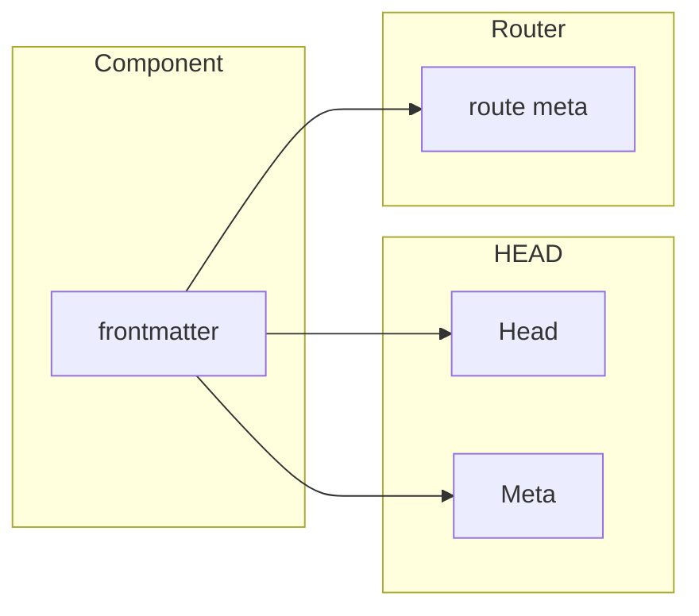

# Meta Builder  for `vite-plugin-md`

> References: [Builder API](./BuilderApi.md), [Build Pipeline](./BuildPipeline.md)

The `meta` _builder_ provides a good set of defaults for your Markdown's meta properties along with the ability to configure it to do virtually anything you'd want.

Using the default functionality of `meta()` is as simple as:

```ts
// vite.config.js
import Markdown, { meta } from 'vite-plugin-md'

export default defineConfig({
  // ...
  plugins: [
    Markdown({ builders: [meta()] }),
  ],
})
```

This builder provides the following functionality:

- **Mapping.** Maps commonly used _frontmatter_ properties to HEAD, META, or ROUTER meta. The properties that come "out of the box" are as follows:

  - Default mapping rules are:

      | Property     | Associated To |
      | ------------ | ------------- |
      | title        | HEAD, META    |
      | description  | META          |
      | layout       | ROUTER        |
      | image        | META          |
      | image_height | META          |
      | image_width  | META          |
      | url          | META          |

  - META properties are given appropriate key/value tags for the typical social platforms typically targeted (e.g., Facebook/OpenGraph uses _property_, Twitter uses _name_, Google Search uses _itemprop_ and _key_ is thrown in for good measure)
  - HEAD properties of any type are allowed for with Title getting special consideration
  - ROUTER properties are moved into the "meta" property for the given route
- **Defaulting**
  - Provides simple and consistent means for default meta values across all classes of meta data
  - Defaults can be static, dynamic (aka, functional callback with context), or can accept reactive properties.
- **@vueuse/head integration**
  - The base plugin offers integration with `@vueuse/head` but this plugin just offers a slightly easier API to use integrate it
  - It also ensures that during build time the head/meta properties are written to the HTML when SSG/SSR is being used
  - Note: like the base plugin, you must use this integration to get HEAD and META properties
- **Meta** event
  - Produces a "meta" event providing all mapped META outputs
  - This event becomes available to all other Builders being used

> **Note:** all properties which are mapped to HEAD, META, or ROUTER are also maintained and available as Frontmatter properties (rather than being moved)

## Categories of Metadata

The categories of metadata supported are illustrated below:



- everything starts out as being defined as a _frontmatter_ property and these properties are owned by the Component/Page itself
- they can then be _mapped_ to:
  - The integration with `@vueuse/head` to manage HEAD and META properties
  - The `vue-router` (if using `vite-plugin-pages`) for ROUTER meta

## Configuration

If you want to amend the default mappings you can do so easily by modifying the `metaProps`, `headProps`, and `routeProps` properties. To create default values you can use `defaults`:

```ts
import Markdown, { link, meta } from 'markdown-it-md'
export default {
  plugins: [
    Markdown({
      builders: [
        meta({
          metaProps: ['title', 'description', 'tags'],
          routeProps: ['layout', 'needsAuth'],
          headProps: ['title'],
          defaults: {
            title: ctx => ctx.h1 || 'Amazing App',
            description: ctx => ctx.path.includes('blog')
              ? 'Amazing Blog'
              : 'Amazing Site',
            copyright: 'Greedy Company Incorporated &copy;2022',
          },
        }),
      ],
    }),
  ],
}
```

### Router Meta

When you're using this plugin with the popular pairing of `vite-plugin-pages` this plugin offers a custom SFC block called `<route>` and this allows your VueJS components to add something like:

```html
<script></script>
<template></template>
<route>
  meta:
    layout: exotic
</route>
```

As convenient as this syntax is for a VueJS component, it feels awkward in Markdown where "notational velocity" is almost always the goal. Fortunately we've got you covered. If you're using the default configuration of this plugin you can express that the "exotic" layout property should be set on the route with just a frontmatter property:

```md
---
layout: exotic
---
# Wow this is Amazing!
```

### Head and Meta

The head and meta properties borrow a lot from the default implementation which this plugin provides but goes further:

- the properties which you mean to target as meta or head props can be stated at the root of the document. For those trying to save keystrokes or disliking YAML array's this is a small nicity
- for META props, not only with the `property` and `content` attributes be set for you but also `itemprop` (google search) and `name` (twitter) will also be set.
- default values can be stated as a static variable, a reactive variable, or a function
