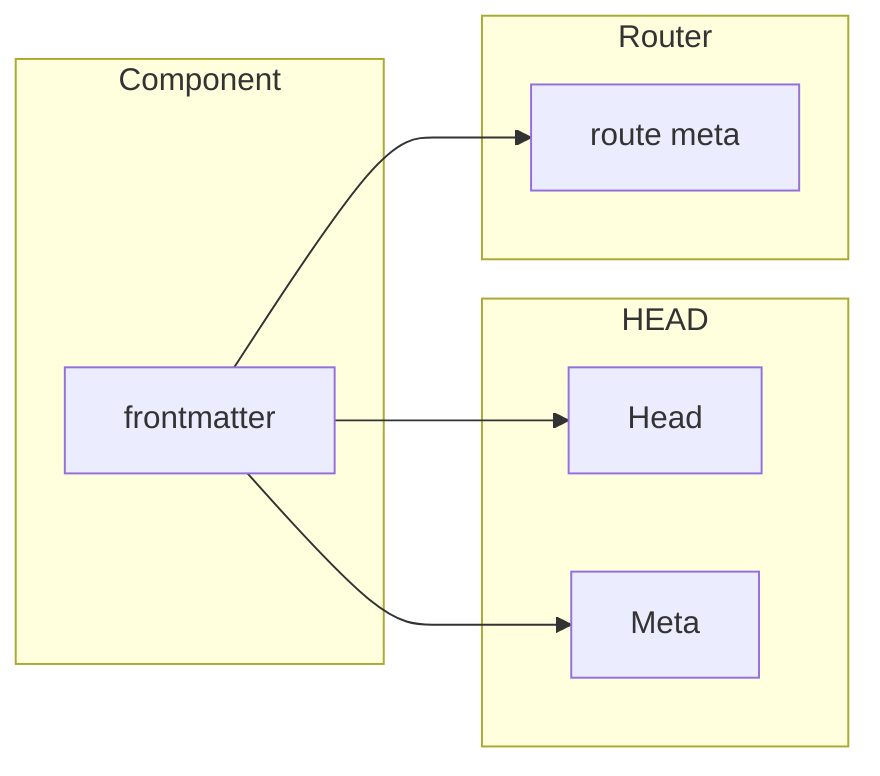
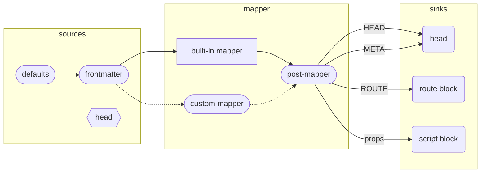

# Meta Builder  for `vite-plugin-md`
> References: [Builder API](./BuilderApi.md), [Build Pipeline](./BuildPipeline.md)

The `meta` _builder_ provides a good set of defaults for your Markdown's meta properties along with the ability to configure it to do virtually anything you'd want.

Using the default functionality of `meta()` is as simple as:

```ts
// vite.config.js
import Markdown, { meta } from 'vite-plugin-md'

export default defineConfig({
    // ...
    plugins: [
        Markdown({ builders: [ meta() ] }),
    ],
})
```

This builder provides the following functionality:

- **Mapping.** Maps commonly used _frontmatter_ properties to HEAD, META, or ROUTER meta. The properties that come "out of the box" are as follows:

    - Default mapping rules are:

        | Property     | Associated To |
        | ------------ | ------------- |
        | title        | HEAD, META    |
        | description  | META          |
        | layout       | ROUTER        |
        | image        | META          |
        | image_height | META          |
        | image_width  | META          |
        | url          | META          |

    - META properties are given appropriate key/value tags for the typical social platforms typically targetted (e.g., Facebook/OpenGraph uses _property_, Twitter uses _name_, Google Search uses _itemprop_ and _key_ is thrown in for good measure)
    - HEAD properties of any type are allowed for with Title getting special consideration
    - ROUTER properties are moved into the "meta" property for the given route
- **Defaulting**
    - Provides simple and consistent means for default meta values across all classes of meta data
    - Defaults can be static, dynamic (aka, functional callback with context), or can accept reactive properties.
- **@vueuse/head integration**
    - The base plugin offers integration with `@vueuse/head` but this plugin just offers a slightly easier API to use integrate it
    - It also ensures that during build time the head/meta properties are written to the HTML when SSG/SSR is being used
    - Note: like the base plugin, you must use this integration to get HEAD and META properties
- **Meta** event
    - Produces a "meta" event providing all mapped META outputs
    - This event becomes available to all other Builders being used

> **Note:** all properties which are mapped to HEAD, META, or ROUTER are also maintained and available as Frontmatter properties (rather than being moved)

## Categories of Metadata

The categories of metadata supported are illustrated below:



- everything starts out as being defined as a _frontmatter_ property and these properties are owned by the Component/Page itself
- they can then be _mapped_ to:
  - The integration with `@usevue/head` to manage HEAD and META properties
  - The `vue-router` (if using `vite-plugin-pages`) for ROUTER meta

## Configuration

If you want to amend the default mappings you can do so easily by modifying the `metaProps`, `headProps`, and `routeProps` properties. To create default values you can use `defaults`:

```ts
import Markdown, { link, meta } from 'markdown-it-md'
export default {
  plugins: [
    Markdown({
      builders: [
        meta({
          metaProps: ['title', 'description', 'tags'],
          routeProps: ['layout', 'needsAuth'],
          headProps: ['title'],
          defaults: {
            title: (ctx) => ctx.h1 || 'Amazing App',
            description: (ctx) => ctx.path.includes('blog')
              ? 'Amazing Blog'
              : 'Amazing Site',
            copyright: 'Greedy Company Incorporated &copy;2022',
          }
        })
      ]
    })
  ]
}
```


### Router Meta

When you're using this plugin with the popular pairing of `vite-plugin-pages` this plugin offers a custom SFC block called `<route>` and this allows your VueJS components to add something like:

```html
<script></script>
<template></template>
<route>
  meta:
    layout: exotic
</route>
```

As convenient as this syntax is for a VueJS component, it feels awkward in Markdown where "notational velocity" is almost always the goal. Fortunately we've got you covered. If you're using the default configuration of this plugin you can express that the "exotic" layout property should be set on the route with just a frontmatter property:

```md
---
layout: exotic
---
# Wow this is Amazing!
```

How this works -- exactly like Head and Meta properties -- is done via mapping.

> See [Mapping section](./docs/MetaMapping.md) for more detail.

For more options available, please refer to [`@vueuse/head`'s docs](https://github.com/vueuse/head).


_Meta mapping_ refers to mapping "data sources" into "data sinks" and is manipulated by changing the API on this plugin's `metaMap` property. At build time (and HMR), this map will take all data available in the sinks and ensure it gets placed into the right output.



Starting with the **sources** as illustrated above:

- `defaults` are a configuration item as illustrated here:
- `frontmatter` is the dictionary elements introduced on the individual page
- where a value doesn't exist in that page's frontmatter, the _defaults_ will be used
- finally, while the `@usevue/head`'s HEAD property isn't directly considered a "source" it is a reactive property and often contains default values in it so if the frontmatter doesn't set this value it will be there as a default assuming you're targeting HEAD/META properties.

With regard to mapping:

- Typically we expect you to use the built in mapper which we provide and gives you useful META mappings out of the box
- To _extend_ the default mapping, you can hook into the **post-mapper**
- Alternatively you can replace the built-in mapper with your own

This leaves us three controllers as sinks:

- The `@vueuse/head` HEAD composable will ensure HEAD and META are injected into the SFC component
- The `route block` will inject meta data into the router
- The `script block` will export all frontmatter variables to be used on the page as well as valid exports that other components can import

## Configuration

The mapping between **Sources** and **Sinks** is highly flexible and managed through a builder API. For instance, to reproduce the "default behavior" of this plugin you would add the following configuration to your `vite.config.[tj]s` file:

```ts
export default {
  // ...
  plugins: [
    Markdown({metaMap: m => m
      .metaProp("title") // the FM "title" maps directly to META property
      .headProp("title") // but it should also be mapped to a HEAD property
      .metaProp("url")
      .metaProp("description")
      .metaProp("image")
      .metaProps("meta") // frontmatter's meta prop is an array of name/value pairs
      .routeProp("layout") // layout prop mapped into meta for router
    })
  ]
}
```

If you just want to _use_ this configuration you don't need to configure anything but if you wanted to use this starting point and _extend_ it you could that like this:

```ts
export default {
  // ...
  plugins: [
    Markdown({ 
      metaMap: m => m
        .useDefault() // extends the default config to start
        .routeFlag("requiresAuth") // adds boolean flag to route meta
        .defaults({
            title: "My App",
            lastUpdated: (i) => await getUpdated(i),
            section: (i) => i.path.includes("blog") ? "blog" : "other"
        })
   })
  ]
}
```
> Note: `defaults` can be static values, a function which receives some basic meta, or even a reactive property (`ref` or `computed`)


In 99.9% of cases this should be all you need but if you want to hook into final stage of producing meta data, there is more your mad creative mind would like to do, you can hook into the `postMapper` hook:

```ts
export default {
  // ...
  plugins: [
    Markdown({ 
      metaMap: m => m
        // your config
        .postMapper({ head, meta, route, props })
    })
  ]
}
```

This gives you each category of meta data in key/value form and you can mutate it as you please.