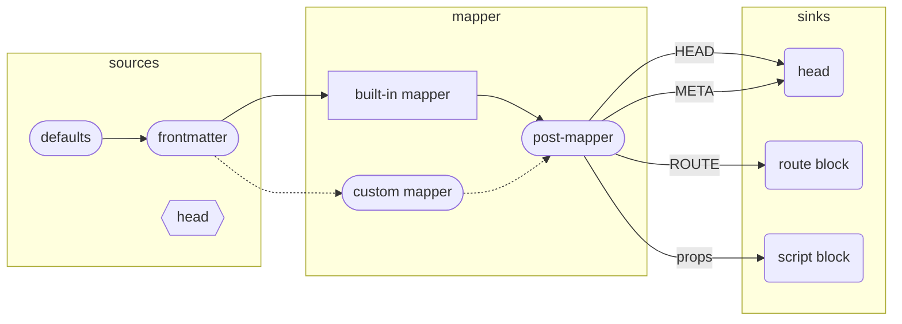

# Meta Mapping

_Meta mapping_ refers to mapping "data sources" into "data sinks" and is manipulated by changing the API on this plugin's `metaMap` property. At build time (and HMR), this map will take all data available in the sinks and ensure it gets placed into the right output.



Starting with the **sources** as illustrated above:

- `defaults` are a configuration item as illustrated here:
- `frontmatter` is the dictionary elements introduced on the individual page
- where a value doesn't exist in that page's frontmatter, the _defaults_ will be used
- finally, while the `@usevue/head`'s HEAD property isn't directly considered a "source" it is a reactive property and often contains default values in it so if the frontmatter doesn't set this value it will be there as a default assuming you're targeting HEAD/META properties.

With regard to mapping:

- Typically we expect you to use the built in mapper which we provide and gives you useful META mappings out of the box
- To _extend_ the default mapping, you can hook into the **post-mapper**
- Alternatively you can replace the built-in mapper with your own

This leaves us three controllers as sinks:

- The `@vueuse/head` HEAD composable will ensure HEAD and META are injected into the SFC component
- The `route block` will inject meta data into the router
- The `script block` will export all frontmatter variables to be used on the page as well as valid exports that other components can import

## Configuration

The mapping between **Sources** and **Sinks** is highly flexible and managed through a builder API. For instance, to reproduce the "default behavior" of this plugin you would add the following configuration to your `vite.config.[tj]s` file:

```ts
export default {
  // ...
  plugins: [
    Markdown({metaMap: m => m
      .metaProp("title") // the FM "title" maps directly to META property
      .headProp("title") // but it should also be mapped to a HEAD property
      .metaProp("url")
      .metaProp("description")
      .metaProp("image")
      .metaProps("meta") // frontmatter's meta prop is an array of name/value pairs
      .routeProp("layout") // layout prop mapped into meta for router
    })
  ]
}
```

If you just want to _use_ this configuration you don't need to configure anything but if you wanted to use this starting point and _extend_ it you could that like this:

```ts
export default {
  // ...
  plugins: [
    Markdown({ 
      metaMap: m => m
        .useDefault() // extends the default config to start
        .routeFlag("requiresAuth") // adds boolean flag to route meta
        .defaults({
            title: "My App",
            lastUpdated: (i) => await getUpdated(i),
            section: (i) => i.path.includes("blog") ? "blog" : "other"
        })
   })
  ]
}
```
> Note: `defaults` can be static values, a function which receives some basic meta, or even a reactive property (`ref` or `computed`)


In 99.9% of cases this should be all you need but if you want to hook into final stage of producing meta data, there is more your mad creative mind would like to do, you can hook into the `postMapper` hook:

```ts
export default {
  // ...
  plugins: [
    Markdown({ 
      metaMap: m => m
        // your config
        .postMapper({ head, meta, route, props })
    })
  ]
}
```

This gives you each category of meta data in key/value form and you can mutate it as you please.